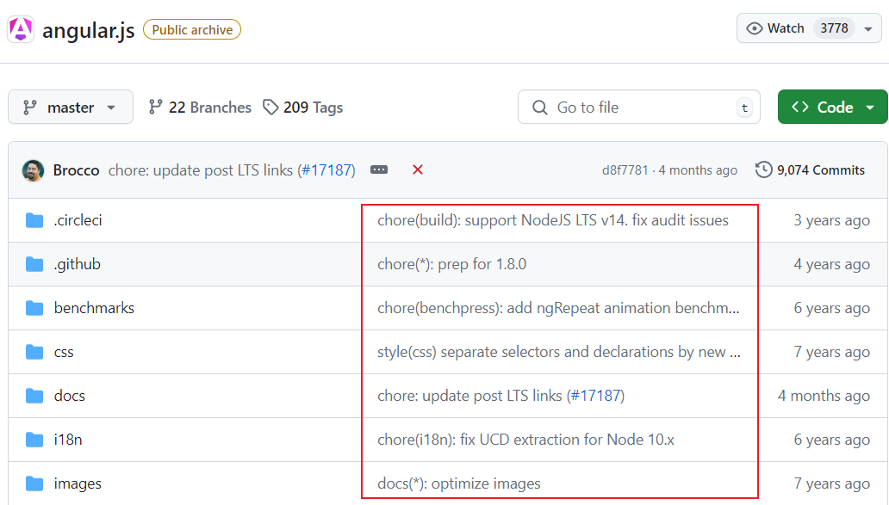
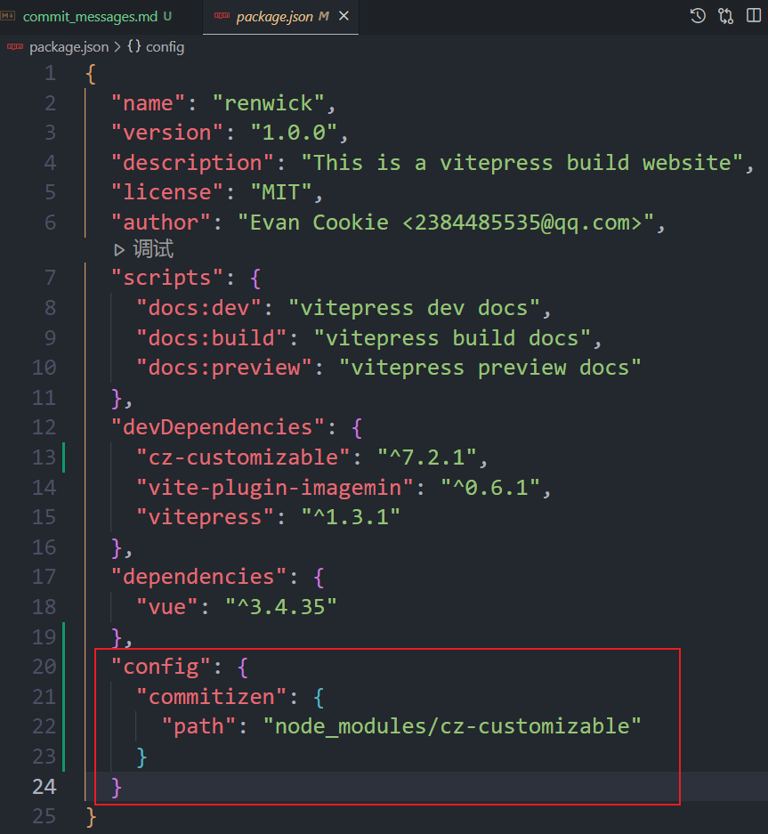

## 1. 前言

在我们目前的前端项目中，我们采用 `git` 作为版本控制工具。使用 `git` 管理项目意味着我们经常需要提交代码。当我们执行 `git commit -m "描述信息"` 命令时，我们被要求提供一个描述信息。然而，由于每个人的理解和表达方式不同，提交信息的多样性有时会导致信息的模糊和不明确。


为了提高团队的协作效率和代码质量，我们需要建立一套统一的提交规范，确保每次提交的信息都是清晰、一致且具有描述性的。如下图




## 2. 提交规范

目前规范用的比较多的是 [Angular 团队的规范](https://github.com/angular/angular.js/blob/master/DEVELOPERS.md#-git-commit-guidelines)格式如下：

每个提交信息由header、body和footer组成。header 有一个特殊的格式，包括type、scope和subject

```
<type>(<scope>): <subject>
<BLANK LINE> 空行
<body>
<BLANK LINE> 空行
<footer>
```

**类型（type）：**

- **feat**: 新功能
- **fix**: bug修复
- **docs**: 仅文档的更改（文档更新）
- **style**: 不影响代码含义的更改(空白、格式化、缺少分号等)
- **refactor**: 既不修复错误（bug）也不增加功能的代码更改
- **perf**: 改进性能的代码更改
- **test**: 添加缺失的测试或更正现有的测试
- **chore**: 对构建过程或辅助工具和库(如文档生成)的更改

**范围（scope）：**

指定提交更改位置的任何内容（提交影响的代码模块或功能区域）。

:::tip 提示
You can use * when the change affects more than a single scope.
（当更改影响多个作用域时，可以使用*）。
:::

**主题（subject）：**

主题包含对变化的简洁描述:
 - 使用祈使句，现在时:"change"而不是"changed"也不是"changes"
 - 第一个字母不要大写 
 - 末尾没有点(.)

**身体（body）：**

身体应该提供更详细的描述：包括改变的动机，并将其与之前的进行对比。

**页脚（footer）：**

页脚应该包含有关突破性更改的任何信息，通常是 BREAKING CHANGE 或修复的 issue 链接

例如：
```
feat(login): Add login authorization feature

Update the login process to include enterprise authorization.

Closes issue #188.

```

## 3. Commitizen（工具）

### 3.1 简介

[Commitizen](https://github.com/commitizen/cz-cli)（cz-cli）是一个命令行工具，它帮助开发者遵循某种提交消息规范（如Angular、Conventional Commits等）来格式化Git提交信息。他提供了一个命令 `git cz`，它替代了传统的`git commit`命令。

Commitizen 需要适配器来遵循特定的提交规范。Commitizen 本身是一个框架，它提供了一个命令行界面来引导开发者填写 Git 提交信息。然而，Commitizen 本身并不定义提交信息的具体格式或规范；它依赖于适配器来解析和验证提交信息是否符合特定的规范。

### 3.2 使用

要在项目中使用Commitizen，通常需要执行以下步骤：

第一步：全局安装Commitizen工具（cz-cli）。

```bash
npm install -g commitizen
```

第二步：安装 cz-customizable 适配器（也可搭配其他适配器使用）

```bash 
npm i cz-customizable --save-dev
```
第三步：配置 Commitizen

```json
"config": {
  "commitizen": {
    "path": "node_modules/cz-customizable"
  }
}
```



第四步：在项目根目录下创建 `.cz-config.js` 文件

```js
module.exports = {
  // 可选类型
  types: [
    { value: "feat", name: "feat: 新功能" },
    { value: "fix", name: "fix: 修复" },
    { value: "docs", name: "docs: 文档更新" },
    {
      value: "style",
      name: "style: 不影响代码含义的更改(空白、格式化、缺少分号等)",
    },
    {
      value: "refactor",
      name: "refactor: 重构(既不修复错误bug也不增加功能的代码更改)",
    },
    { value: "perf", name: "perf: 改进性能的代码更改" },
    { value: "test", name: "test: 增加测试" },
    { value: "chore", name: "chore: 构建过程或辅助工具的变动" },
    { value: "revert", name: "revert: 回退" },
    { value: "build", name: "build: 打包" },
  ],

  // 定义你的作用域列表(省略此字段，则作用域将是可选的)
  scopes: [  
    // 你可以列出项目中的模块、组件或其他分类作为作用域选项。  
    'docs',  
    // 或者使用通配符来允许自定义作用域  
    '*'  
  ],  
  
  // 消息步骤
  messages: {
    type: "请选择提交类型:",
    customScope: "请输入修改范围(可选):",
    subject: "请简要描述提交(必填):",
    body: "请输入详细描述(可选):",
    footer: "请输入要关闭的issue(可选):",
    confirmCommit: "确认使用以上信息提交？(y/n/e/h)",
  },

  // 跳过步骤
  skipQuestions: ["body", "footer"],

  // subject文字长度默认是72
  subjectLimit: 72,
}
```

5、使用git cz 代替git commit来创建提交


