## Gitee 简介


[Gitee](https://gitee.com/) 是一个 Git 仓库管理网站，可以创建远程中心仓库，为多人合作开发提供便利，与 Gitee 类似的网站还有很多，例如：[GitHub](https://github.com/)、[GitLab](https://about.gitlab.com/) 等等，有了 Gitee 的基础后 GitHub 和 GitLab 也同样能很快上手。

## 1. 新建远程仓库

第一步：打开gitee官网，点击 `+` 
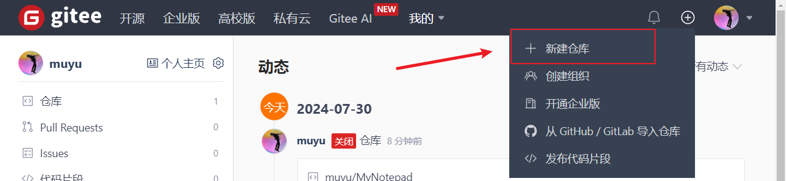

第二步：编辑仓库信息，点击创建
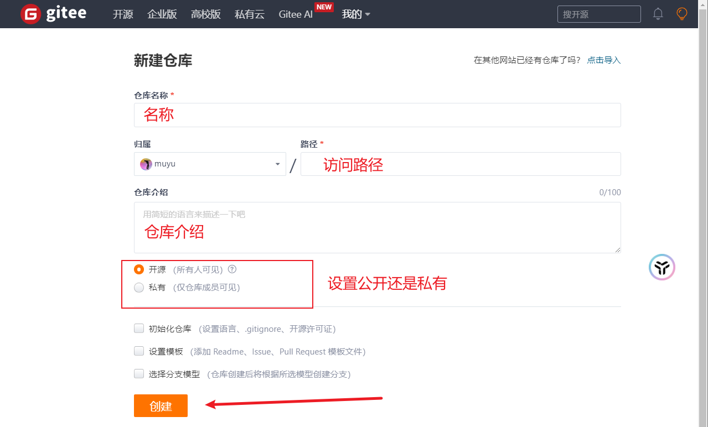

第二步：创建完成
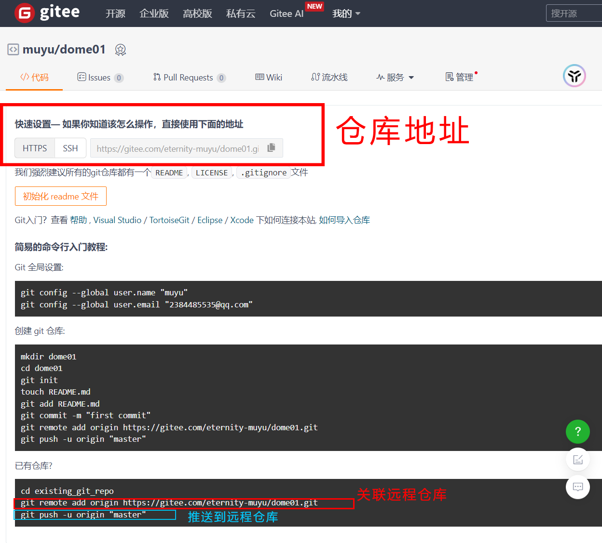

## 2. 关联远程库

第一步：维护好本地仓库（所有文件均接受版本控制）。

```bash
git add xxxx
git commit -m '注释'
```

第二步：注册并激活 Gitee 账号。

第三步：创建远程仓库，并获取仓库的地址。

第四步：配置本地仓库关联远程仓库：

```bash
git remote add origin https://xxxx/xxxx/xxxxx.git
```

::: tip
- `origin` 为仓库的别名，可更改
- 查看当前仓库关联远程仓库地址：`git remote -v`
- 更改远程仓库的 URL：`git remote set-url origin 新的仓库URL`
- 删除与远程仓库的关联：`git remote remove origin`
:::

## 3. 推送代码

将本地仓库的 master 分支推送到远程仓库

```bash
git push -u origin master
```

::: tip
- 可能会弹窗提示输入密码 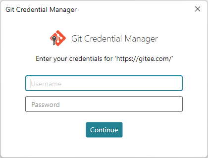
- push 表示推送。
- -u（upstream） 表示关联，加上 -u 以后，后续提交时可以直接使用 git push 即可。
- origin 远端仓库的别名。
- master 本地仓库的分支名称。
:::

## 4. 拉取代码

当本地仓库想获得远程仓库的最新修改时，可以使用`git pull`命令拉取远端代码。

```bash
git pull
```

::: tip
git pull 会将远端代码自动执行合并操作，即：将远程分支的修改合并到本地当前分支。
::: 

## 5. 关于冲突

- 合并/变基引起的冲突：两个分支在同一文件的同一位置都有修改时，合并或变基时会引起冲突。
- 拉取引起的冲突：不同的开发者修改了同一文件的同一位置都有修改时，拉取代码会有冲突。

## 6. 克隆远程库

获取一个远程仓库的地址，随后执行克隆命令

```bash
git clone https://xxxx/xxxx/xxxx.git
```

使用 `--depth 1` 参数可以克隆仓库的最近一次提交，这样可以减少克隆所需的时间和空间。

```bash
git clone --depth 1 https://xxxx/xxxx/xxxx.git
```

::: warning
- 克隆下来的仓库，使用 `git branch` 命令，只能看到默认分支，其他分支其实也已经克隆下来了，但不出现在`git branch`列表中，需要使用`git branch -r`或 `gir branch -a`来查看。

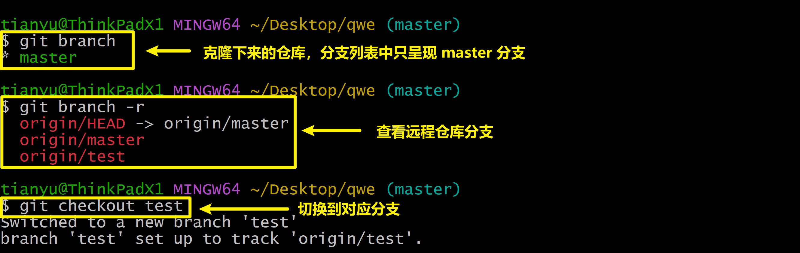

- 需要切换到其他分支时，可以直接`git checkout -b xxx origin/xxx`来进行切换，当然对于 1.7.0 以后得 git 版本，也可以使用简短的命令：`git checkout xxx`来切换。


:::

## 7. SSH 协议

### 7.1. 公钥加密

我们来举个例子，你在A城市，想给你在B城市的朋友张三发送一个机密的信件，由于工作原因，你无法亲自去送，同时你也担心快递不能严格的保密。这时你就可以使用公钥加密技术，大致思路是：

- 张三先给你一个特制的保险箱（公钥），这个保险箱仅有一把 能打开它的钥匙，钥匙在张三那里。
- 你将信件放入保险箱并锁上，随后交给快递员，快递员携带着这个箱子去送货，但无法打开它。
- 快递到达张三手里的钥匙（私钥）打开保险箱，取出信件。

**总结：**

1. 通过这种方式，即使在不完全可信的通道上，你的信件也能安全到达目的地，没有人能够在途中打开保险箱并窃取它。这就是公钥加密的工作原理。
2. 使用公钥（所有人可见的保险箱）来加密信息，而只有对应的私钥（只有接收者持有的钥匙）能解密信息。这种方法不仅保护了数据的安全性，还确保了数据传输的私密性和完整性。

### 7.2. SSH 简介

SSH（Secure Shell）是一种网络协议，SSH利用公钥加密技术提供了一种安全的方法，来管理和操作远程计算机，保护数据的安全和隐私

### 7.3. Gitee 使用 ssh

[Gitee SSH 公钥设置](https://help.gitee.com/base/account/SSH%E5%85%AC%E9%92%A5%E8%AE%BE%E7%BD%AE)

[Gitee SSH Key 配置管理](https://help.gitee.com/base/account/SSH%E5%85%AC%E9%92%A5%E8%AE%BE%E7%BD%AE)

::: details 第一步：生成 SSH 公钥
1. 使用以下命令生成公钥
```bash
ssh-keygen -t ed25519 -C "Gitee SSH Key"
```
2. 提示输入公钥的保存地址，如无需修改，直接回车即可：
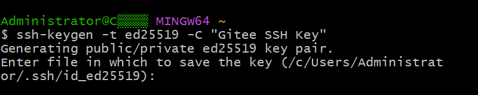
3. 提示是否为私钥建立密码，如需要直接输入，不需要直接回车：

4. 提示确认密码，输入和上一步相同的密码即可，若无密码直接回车：

5. 提示生成完毕
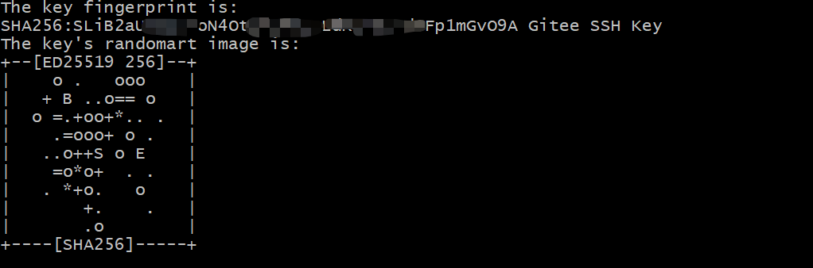
:::

::: details 第二步：在Gitee上配置公钥
1. 输入`ls ~/.ssh/`命令查看生成的公钥与私钥
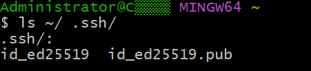
- 私钥文件 `id_ed25519`
- 公钥文件 `id_ed25519.pub`
2. 使用`cat ~/.ssh/id_ed25519.pub`查看公钥
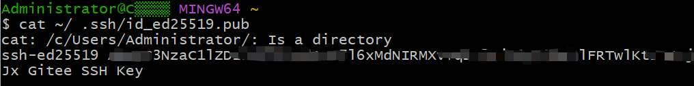
3. 复制公钥，添加到Gitee设置中
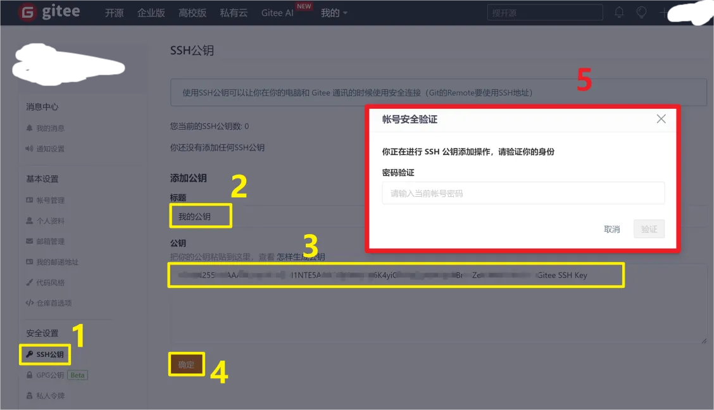
:::

::: details 第三步：本地库与远端交互
1. 尝试使用 ssh 方式克隆仓库

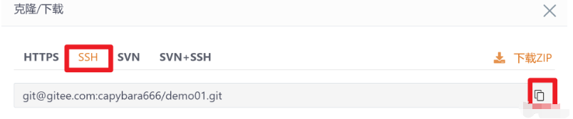

2. 第一次操作，此处会有提示，输入 yes 即可


3. 克隆成功 （后续的拉取，推送，可以直接尽心，无序任何的密码输入）
:::


