## 1. VSCode Git插件推荐

VSCode 中有很多 git 相关的插件，本教程中推荐下面两个：

## 2. 创建仓库

如图所示点击操作，即可借助`Vscode`来创建仓库

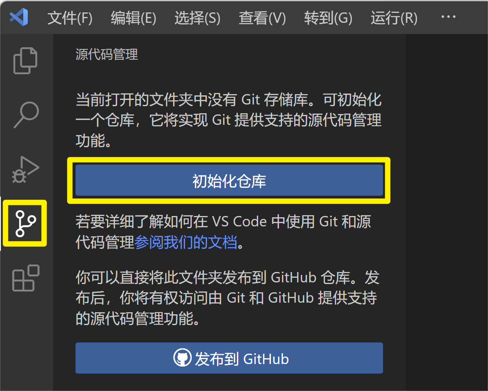

不同的工具创建出来的主分支名字可能不一样，比如 Vscode 中通过点击下方按钮创建的仓库，主分支的名字就叫`main`，当然也可以进行修改，让 Vscode 默认的主分支名是 `master`

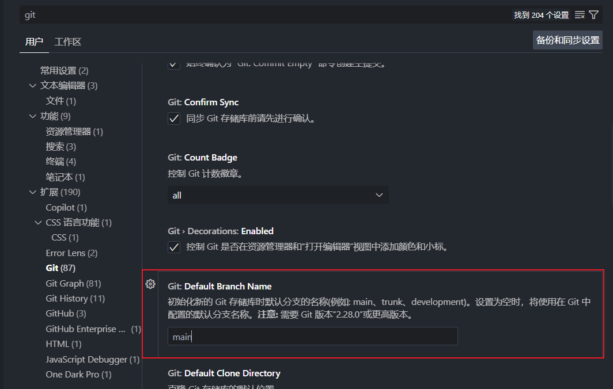

## 3. 版本控制

点击  `+`  将文件添加到暂存区（相当于`git add`命令）

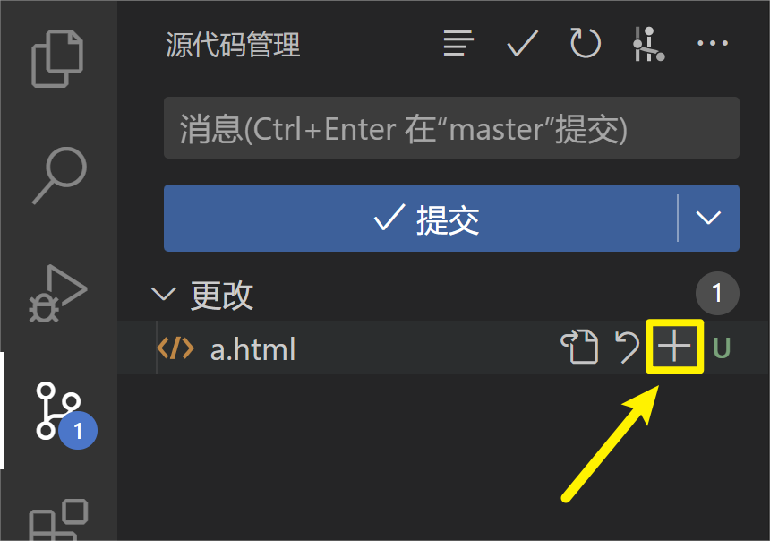

点击【提交】将文件添加到版本区（相当于`git commit`命令）

## 4. 撤销暂存

点击 `—` 撤销对 b 文件的暂存

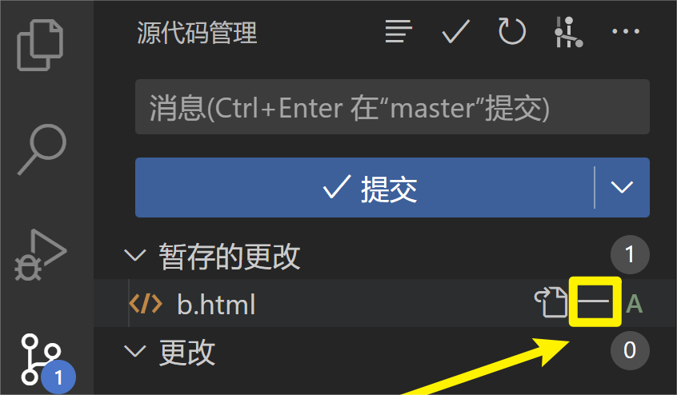

## 5. 查看日志

点击【Git Graph】查看仓库日志

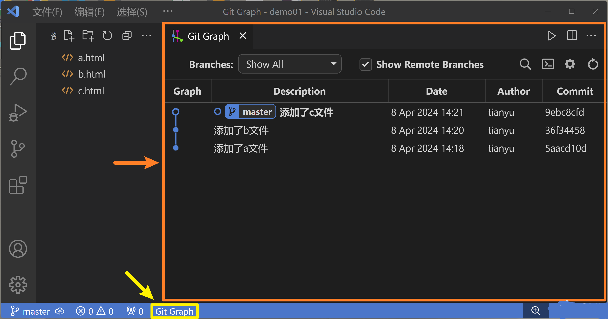

## 6. 对比差异

点击文件名对比文件和上次提交的差异

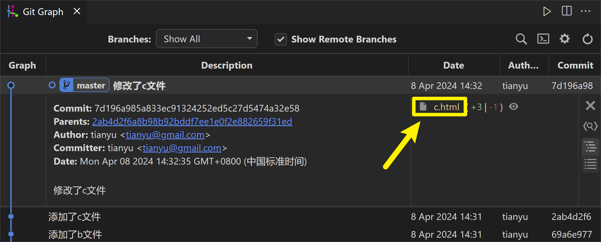

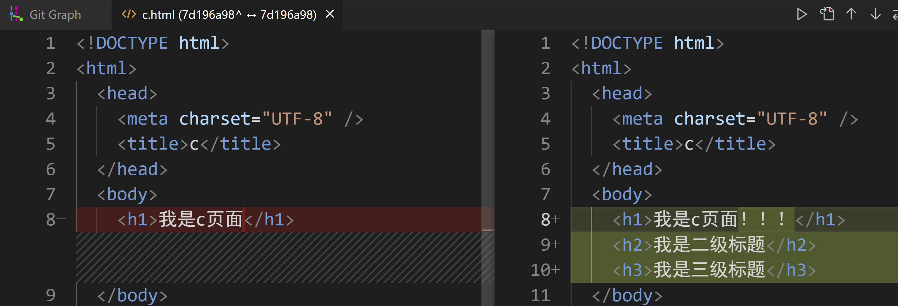

点击某个版本的提交后，按住 ctrl 点击另一个版本号，可以对比两个版本的区别

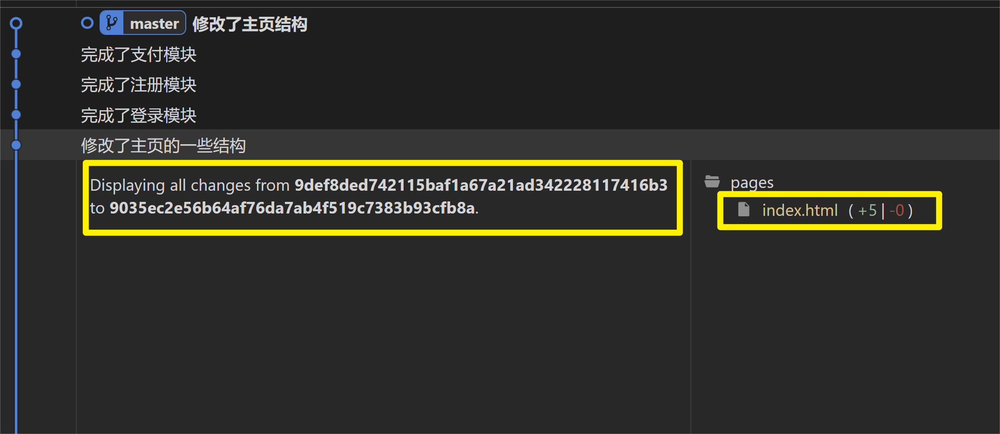

## 7. 版本回退

借助 Git Graph 以游离分支的形式回退（本质是 `git checkout 版本号`）

借助 Git History 版本回退（本质是 `git reset --hard 版本号`或 `git reset --soft 版本号`）

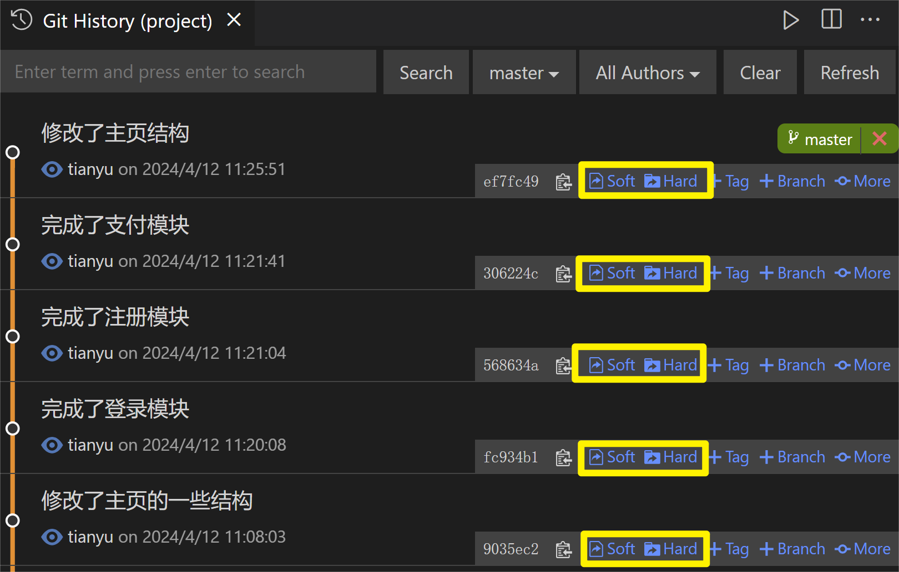

## 8. 添加 tag

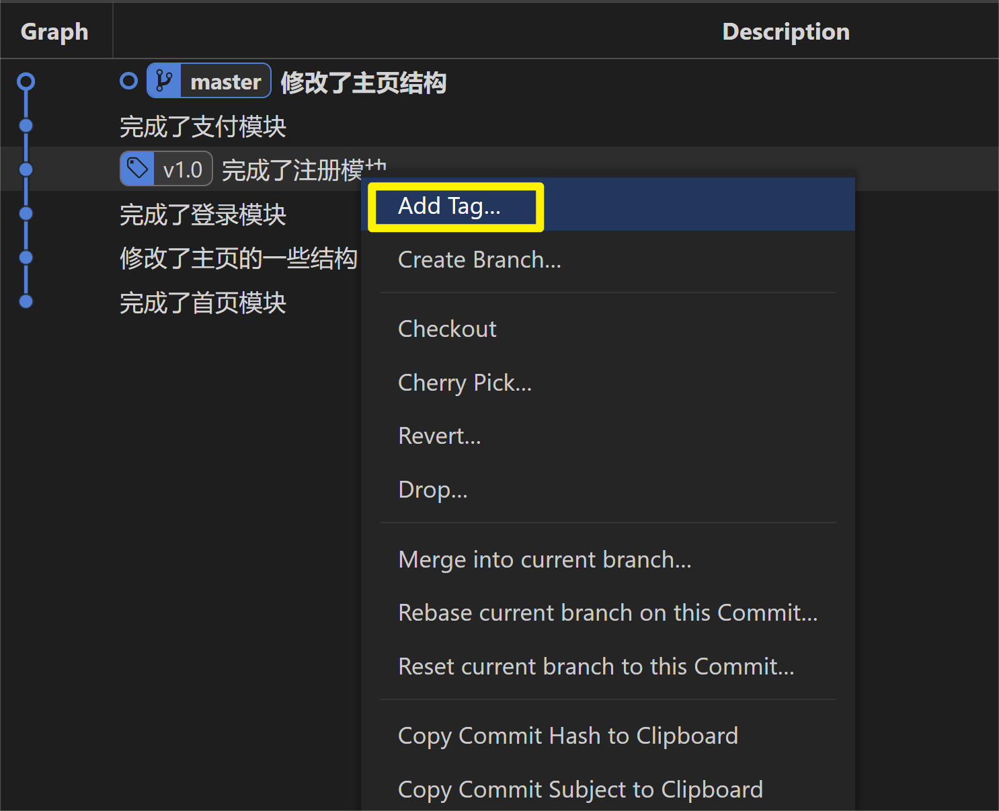

## 9. 创建分支

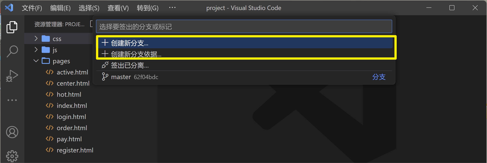

## 10. 分支合并

在当前分支上鼠标右键，随后选择将当前分支合并到哪个分支

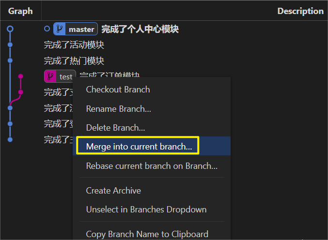

选择 **Yes,merge**

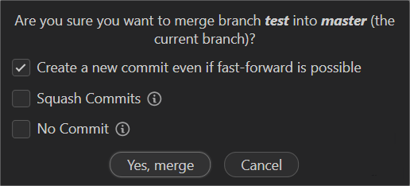

## 11. 分支变基

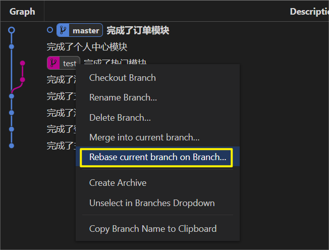

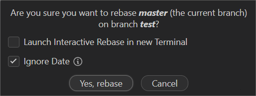

## 12. 推送代码

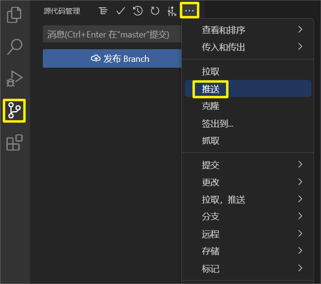

## 13. 拉取代码

## 14. 处理冲突

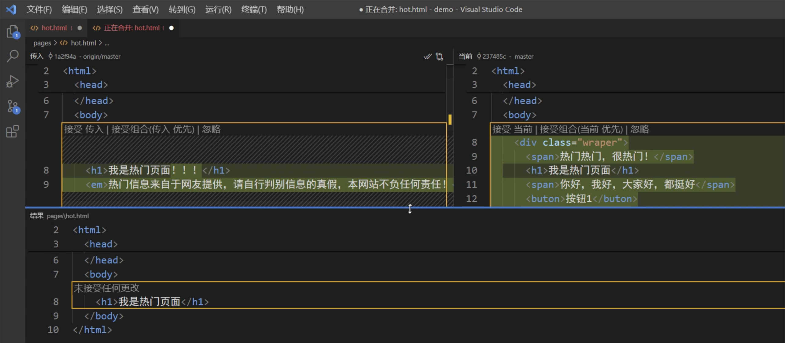

