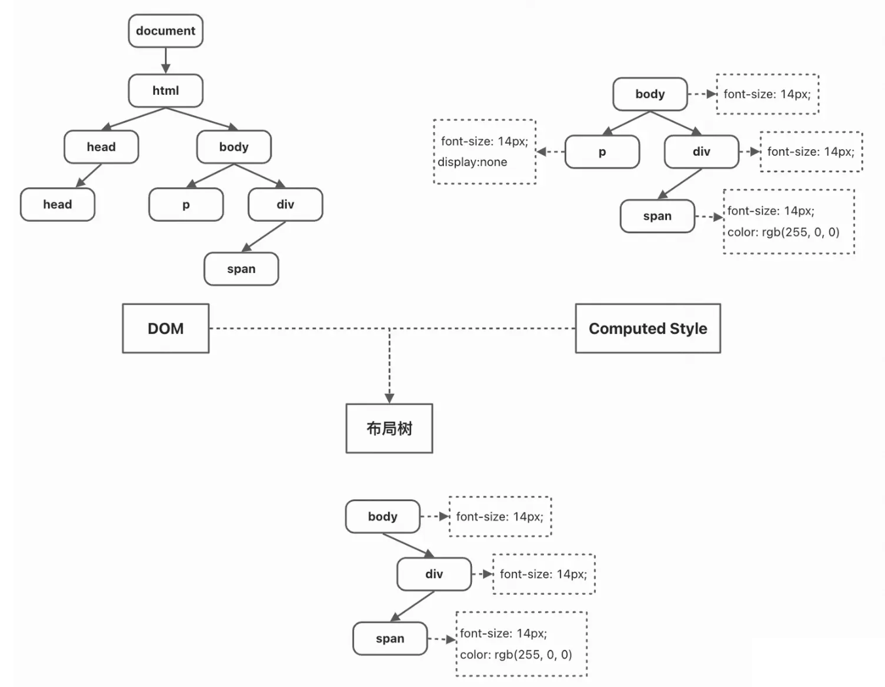
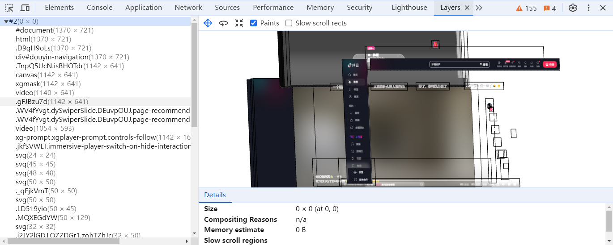

---
outline：[2,6]
---
## 1. 进程与线程

### 1.1 进程

**进程是系统进行资源调度和分配的的基本单位**，一个进程可以认为是一个程序的运行实例。启动一个程序的时候，操作系统会为该程序创建一块内存，用来存放代码、运行中的数据和一个执行任务的主线程，我们把这样的一个运行环境叫进程。

### 1.2 线程

**线程是依附于进程的，是操作系统可识别的最小执行和调度单位**，而进程中使用多线程并行处理能提升运算效率，多线程可以并行处理任务，但是线程是不能单独存在的，它是由进程来启动和管理的。我们最熟悉的 JS 的运行就是线程这个维度。

:::tip 进程与线程间的区别：
- 一个线程依附于一个进程，一个进程可以有多个线程；
- 线程之间共享进程中的数据。
- 进程中的任意一线程执行出错，都会导致整个进程的崩溃，而进程之前不会相互影响。
- 当一个进程关闭之后，操作系统会回收进程所占用的内存。
- 进程之间的内容相互隔离，只能通过 IPC 通信。

> 进程好比火车，线程好比车厢，一辆火车有多节车厢，不同的火车之间互不干扰，但是一节车厢失火会殃及多节车厢
:::

## 2 Chrome 架构

Chrome 浏览器包括：1 个 Browser 主进程、1 个 GPU 进程、1个 Utility 进程、多个 Renderer 进程和多个 Plugin 进程。

- Browser 主进程（浏览器进程）：主要负责界面显示、用户交互、子进程管理，同时还包含网络请求和文件访问等。
- GPU 进程：与其他进程隔离处理 GPU 任务。
- Renderer 进程（渲染进程）：核心任务是将 HTML、CSS 和 JavaScript 转换为用户可以与之交互的网页，排版引擎 Blink 和 JavaScript 引擎 V8 都是运行在该进程中，默认情况下，Chrome 会为每个 Tab 标签创建一个渲染进程。
- Plugin 进程：主要是负责插件的运行，因插件易崩溃，所以需要通过插件进程来隔离，以保证插件进程崩溃不会对浏览器和页面造成影响。
- Utility 进程：主要负责执行一些浏览器的工具和附加功能

## 3. 渲染时间点

- 当浏览器的网络进程，收到服务器返回的 HTML 文档后，会产生一个渲染任务，并将其传递给渲染主进程的消息队列。
- 在事件循环的作用下，渲染主进程从消息队列中取出渲染任务，开启渲染流程。

渲染的核心工作是将 HTML、CSS 和 JavaScript 转换为用户可以与之交互的网页。在这个工作过程中，输入的 HTML 经过一些子阶段，最后输出像素。

## 4. 浏览器渲染原理

按照渲染的时间顺序，大致可分为：构建 DOM 树、计算样式、布局、分层、绘制、分块、光栅化和合成。

### 4.1 构建 DOM树

当渲染进程开始接收 HTML 数据时，主线程开始解析 HTML 并将其转换为浏览器能够理解的结构 [DOM](https://developer.mozilla.org/zh-CN/docs/Web/API/Document_Object_Model)树。

 - 在 DOM 树的解析过程中，如果遇到 img、css 或者 js 资源时，主线程会向 Browser 主进程的网络线程发送请求以获取对应的资源。

 - HTML解析过程中如果遇到CSS，浏览器会启动一个预解析器来下载CSS，从而不会暂停 HTML的解析

 - 当解析的过程中遇到 `<script>` 标签时，主线程会暂停 HTML 的解析，从而进行 js 代码的加载、解析和执行。因为 js 代码中可能涉及对页面结构的修改，主线程必须等待 js 运行才能恢复对 HTML 文档的解析。我们可以通过在 `<script>` 标签上加上 async 或者 defer 属性来异步加载执行 js 代码，避免 js 阻塞 HTML 的解析。

### 4.2 构建 CSSOM树

 - 浏览器在解析HTML的同时或之后，会解析CSS样式表，将其转换成浏览器能够理解的样式对象模型[CSSOM](https://developer.mozilla.org/zh-CN/docs/Web/API/CSS_Object_Model)树。

 - CSSOM树描述了页面上所有CSS选择器的层级结构和属性

### 4.3 计算样式

样式计算的目的是为了计算出 DOM 节点中每个元素的具体样式，在计算过程中需要遵守 CSS 的继承和层叠两个规则，大体可分为以下几点：

 - 有了DOM树和CSSOM树之后，浏览器会结合这两棵树来进行构建

 -  构建过程中会转换样式表中的属性值，使其标准化。比如：相对单位会变成绝对单位（`em`变成`px`）

 - 最终构建出一棵带有全部节点具体样式的DOM树

::: tip 提示
在浏览器中，我们可以通过 Computed 面板查看当前节点的 Computed Style。

:::

### 4.4 布局

有了 DOM 树和 DOM 对应的 Computed Style 之后还不足以显示页面，接下来还需要计算出 DOM 树中可见元素的几何位置，这个计算过程叫做布局。

:::warning 注意
大部分时候，DOM 树和布局树并非一一对应。
 - display:none 的节点没有几何信息，因此不会生成到布局树
 
 - 伪元素选择器，虽然 DOM 树中不存在这些伪元素节点，但它们拥有几何信息，所以会生成到布局树中。
 
  - 匿名行盒、匿名块盒等等都会导致 DOM 树和布局树无法一一对应。
:::

### 4.5 分层

有了布局树后，对于一些简单页面已经具备绘制条件了，但是对于我们现代的页面来说，有很多复杂的效果，如一些复杂的 3D 转换、 z-index 做 z 轴排序等，对于这些场景为了页面展示的正确性，渲染引擎还会为特定的节点生成专用的图层，并生成一棵对应的图层树。

:::warning 注意
 - 并不是每个节点都包含一个图层，如果一个节点没有对应的层，那么这个节点就从属于父节点所在的图层。最终每一个节点都会直接或者间接地从属于一个图层。

通常满足下面两点便会提升为一个单独的图层：
1. 拥有层叠上下文属性的元素会被提升为单独的一层。层叠上下文
2. 需要剪裁的地方也会被创建为图层（overflow）。

可以在浏览器的 layers 面板看到当前页面的分层情况：

:::

### 4.6 绘制

在确定了 DOM 树、计算样式以及布局树仍然不足以绘制页面，这里还需要有明确的绘制顺序，在此过程中主线程会遍历布局树并创建绘制记录。渲染主线程的⼯作到此为⽌，剩余步骤交给其他线程完成。

:::tip 提示
同样，我们可以在浏览器的 layers 面板看到当前页面对应图层的绘制记录：

:::

### 4.7 分块

由于我们浏览器的视口是有限的，但是页面的长度可能很长，有些图层可能超过视口很多，而用户对页面的感知是视口维度的，一次性渲染整个图层未免有些浪费，因此合成线程首先对每个图层进行分块，将其划分为更多的小区域。它会从线程池中拿取多个线程来完成分块工作。

分块的⼯作是交给多个线程同时进⾏的

### 4.8 光栅化（栅格化）

有了图块之后，合成线程会将每一个图块发送到光栅线程（Raster thread），光栅线程会光栅化每一个图块并存在 GPU 内存中。在这个过程中，合成线程会优先选择视口内（靠近视口的块）的图块提交给光栅线程。

### 4.9 合成

光栅化完成后，合成线程会创建合成帧通过 IPC 通信提交给浏览器进程。浏览器进程接收到合成帧后，会将其内容绘制到内存中（具体来说，是绘制到浏览器进程的绘图缓冲区中）。最后，浏览器会利用操作系统的图形系统将内存中的图像渲染到屏幕上。

至此，从接收 HTML 数据到页面的展示全流程就结束了

## 5. 重排（reflow ）

又称回流，本质就是重新计算Layout树，当我们通过 js 或者 css 属性更新了元素的几何属性，例如元素的宽度、高度，此时浏览器会重新触发布局 Layout 并重新执行后面全部的渲染流程，因此，重排的开销是最大的。

## 6. 重绘（repaint）

repaint 的本质就是重新根据分层信息计算了绘制指令。当我们通过 js 或者 css 更新元素的绘制属性，例如元素的背景色、文字的颜色等，此时布局和分层阶段被省略，只执行后续的流程，因此重绘的开销相比重排会小很多。

:::tip 小提示
为什么我们为了避免重排和重绘而去采用 css3 的 transform 等属性呢？因为此时整个主线程的流程会被全部跳过，执行后续的流程，而后续的流程交给了在执行线程、光栅线程和 GPU 进程上执行没有占据主线程的资源，因此效率是最高的。

:::