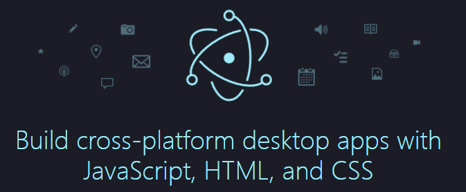
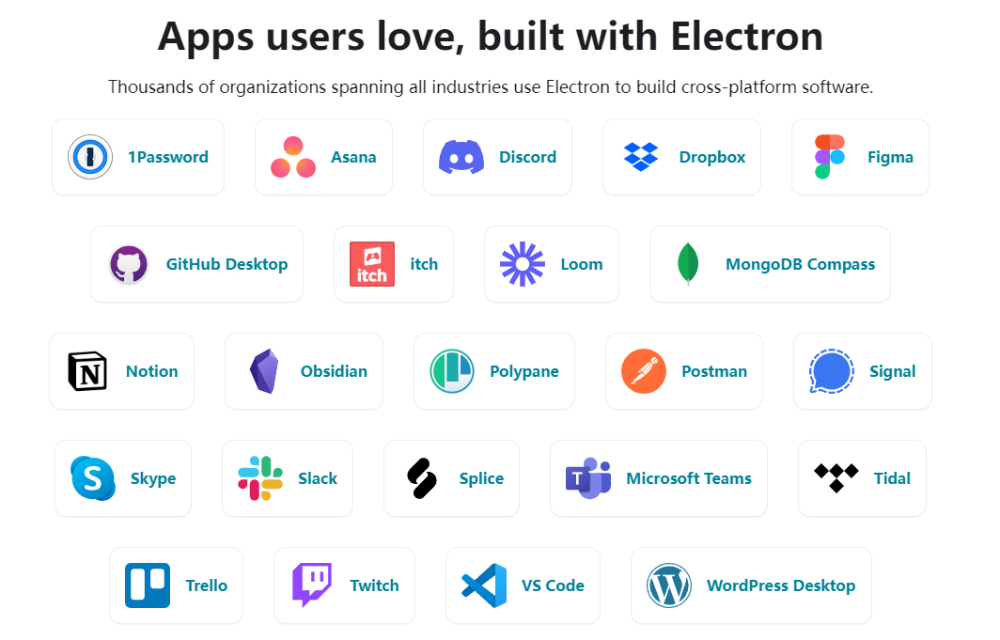
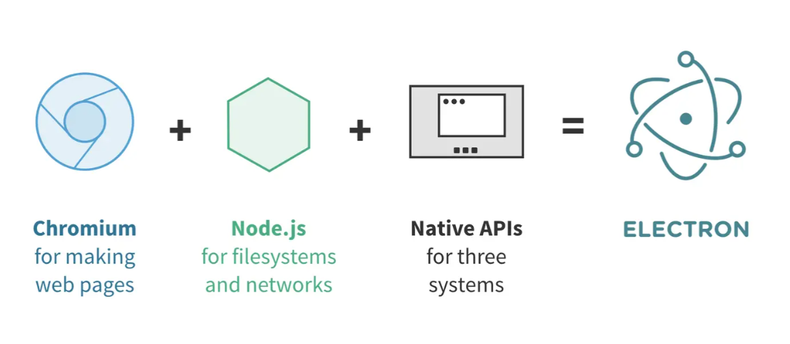
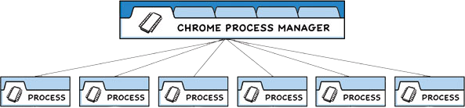
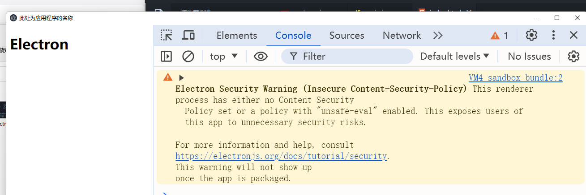
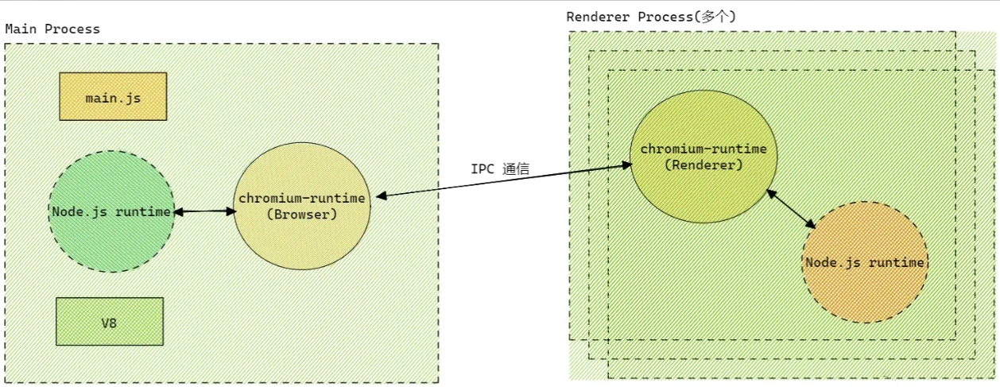
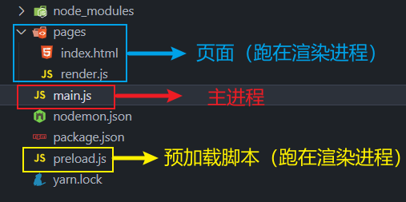
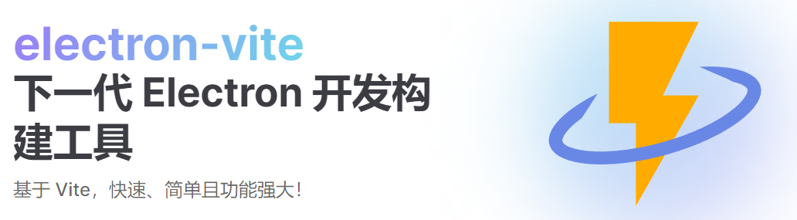

## 1. Electron 简介



[Electron](https://www.electronjs.org/) 是一个使用 JavaScript、HTML 和 CSS 构建桌面应用程序的框架。Electron  将 [Chromium](https://www.chromium.org/chromium-projects/) 和 [Node.js](https://nodejs.org/) 嵌入到了一个二进制文件中，因此它允许你仅需一个JavaScript代码仓库，就可以撰写支持 Windows、macOS 和 Linux 的跨平台应用。




## 2. Electron 的优势

- 可跨平台：同一套代码可以构建出能在：Windows、macOS、Linux 上运行的应用程序。
- 上手容易：使用 Web 技术就可以轻松完成开发桌面应用程序。
- 底层权限：允许应用程序访问文件系统、操作系统等底层功能，从而实现复杂的系统交互。
- 社区支持：拥有一个庞大且活跃的社区，开发者可以轻松找到文档、教程和开源库。


## 3. Electron 技术架构

### 3.1. 技术架构



- **Chromium**： 为 Electron 提供强大的 UI 渲染能力，由于 Chromium 本身跨平台，因此无需考虑代码的兼容性。最重要的是，可以使用HTML、CSS、JavaScript 进行 Electron开发。
- **Node.js**：由于 Chromium 并不具备原生 GUI 的操作能力，因此 Electron 内部集成 Node.js，编写 UI 的同时也能够调用操作系统的底层 API，例如 path、fs、http 等模块。
- **Native API**：为 Electron 提供原生系统的 GUI 支持，借此 Electron 可以调用原生应用程序接口。

::: tip 总结
Chromium 负责页面 UI 渲染，Node.js 负责业务逻辑，Native API 则提供原生能力和跨平台。
:::

### 3.2. 流程模型

Electron 继承了来自 Chromium 的多进程架构，这使得此框架在架构上非常相似于一个现代的网页浏览器。下方来自 [Chrome 漫画](https://www.google.com/googlebooks/chrome/) 的图表可视化了此模型：



Electron 应用程序的结构非常相似。 作为应用开发者，你将控制两种类型的进程：主进程 和 渲染器进程。 这类似于上文所述的 Chrome 的浏览器和渲染器进程。


## 4. 创建应用程序

第一步：初始化一个包，并填写好`package.json`中的必要信息。

```bash
# 创建一个文件夹并进入
mkdir electron-app && cd electron-app
# 初始化(yarn为列 npm、pnpm也可)
yarn init
```

```json
{
  "name": "electron-app",
  "version": "1.0.0",
  "description": "this is a electron dome", // 为后续能顺利打包，此处要编写描述。
  "main": "main.js",
  "author": "Evan Cookie", // 为后续能顺利打包，此处要写明作者。
  "license": "MIT",
}

```

第二步：安装`electron`作为开发依赖以及配置启动命令

```bash
yarn add --dev electron
```

在 `package.json`配置文件中的`scripts`字段下增加一条`start`命令：

```json
{
  "scripts": {
    "start": "electron ."
  }
}
```

第三步：创建主进程`main.js` 并编写代码，创建一个基本窗口

```js
/* 
  main.js: 运行在应用的主进程上，无法访问Web相关API
  主要负责：控制生命周期、显示界面、控制渲染进程等其他操作。
*/
const { app, BrowserWindow } = require("electron")

// 创建窗口
function createWindow() {
  const win = new BrowserWindow({
    width: 800, // 窗口宽度
    height: 600, // 窗口高度
    autoHideMenuBar: true, // 自动隐藏菜单栏
    alwaysOnTop: true, // 置顶
  })

  // 加载一个远程页面
  win.loadURL("https://www.douyin.com")
}

// 当app准备好后，执行createWindow函数
app.on("ready", () => {
  createWindow()
})
```

::: tip 说明
关于 BrowserWindow 的更多配置项，请参考[官方文档](https://www.electronjs.org/zh/docs/latest/api/base-window##实例属性)
:::

第四步：启动应用查看效果

```bash
yarn start
```

效果如下：


## 5. 加载本地页面

第一步：创建`pages/index.html`编写内容：

```html
<!DOCTYPE html>
<html>
  <head>
    <meta charset="UTF-8" />
    <title>此处为应用程序的名称</title>
  </head>
    
  <body>
    <h1>Electron</h1>
  </body>
</html>
```

第二步：修改`mian.js`加载本地页面

```js
win.loadFile('./pages/index.html')
```

第三步：`yarn start` 运行项目，此时开发者工具（Ctrl + Shift + I ）控制台会报出一个安全警告



第四步：需要在`index.html`添加`meta`内容，配置内容安全策略CSP

```html
<meta http-equiv="Content-Security-Policy" 
      content="default-src 'self'; style-src 'self' 'unsafe-inline'; img-src 'self' data:;">
```

::: info 上述配置的说明

1. `default-src 'self'`

   `default-src`：配置加载策略，适用于所有未在其它指令中明确指定的资源类型。

   `self`：仅允许从同源的资源加载，禁止从不受信任的外部来源加载，提高安全性。

2. `style-src 'self' 'unsafe-inline'`

   `style-src`：指定样式表（CSS）的加载策略。

   `self`：仅允许从同源的资源加载，禁止从不受信任的外部来源加载，提高安全性。

   `unsafe-inline`：允许在HTML文档内使用内联样式。

3. `img-src 'self' data:`

   `img-src`：指定图像资源的加载策略。

   `self`：表示仅允许从同源加载图像。

   `data:`：允许使用 `data: URI` 来嵌入图像。这种URI模式允许将图像数据直接嵌入到HTML或CSS中，而不是通过外部链接引用。
:::

::: tip 说明 
关于内容安全策略（CSP）的详细说明请参考：[MDN-Content-Security-Policy](https://developer.mozilla.org/zh-CN/docs/Web/HTTP/Headers/Content-Security-Policy)、[Electron Security](https://www.electronjs.org/docs/latest/tutorial/security)
:::


## 6. 完善窗口行为

1. Windows 和 Linux 平台窗口特点是：关闭所有窗口时退出应用。

```js
// 当所有窗口都关闭时
app.on('window-all-closed', () => {
	  // 如果所处平台不是mac(darwin)，则退出应用。
  if (process.platform !== 'darwin') app.quit()
})
```

2. Mac 应用即使在没有打开任何窗口的情况下也继续运行，并且在没有窗口可用的情况下激活应用时会打开新的窗口。

```js
// 当app准备好后，执行createWindow创建窗口
app.on('ready', () => {
  createWindow()
  // 当应用被激活时
  app.on('activate', () => {
    //如果当前应用没有窗口，则创建一个新的窗口
    if (BrowserWindow.getAllWindows().length === 0) createWindow()
  })
})
```

::: tip 链接
 - Node官网：[process.platform](https://nodejs.org/api/process.html#processplatform)
 - Electron官网:[BrowserWindow.getAllWindows()](https://www.electronjs.org/zh/docs/latest/api/base-window#basewindowgetallwindows)
:::


## 7. 配置自动重启

第一步：安装 Nodemon

```shell
yarn add nodemon -D
```

第二步：修改 package.json 命令

```json
"scripts": {
  "start": "nodemon --exec electron ."
},
```

第三步：创建 nodemon.json文件 配置以下规则

```json
{
  "ignore": [
    "node_modules",
    "dist"
  ],
  "restartable": "r",
  "watch": ["*.*"],
  "ext": "html,js,css"
}
```

配置好以后，当代码修改后，应用就会自动重启了。


## 8. 主进程与渲染进程


Electron 中主要控制两类进程：主进程、渲染器进程。

#### 8.1. 主进程

每个 Electron 应用都有一个单一的主进程，作为应用程序的入口点。 主进程在 Node.js 环境中运行，它具有 require 模块和使用所有 Node.js API 的能力。

[主进程](https://www.electronjs.org/zh/docs/latest/tutorial/process-model#%E4%B8%BB%E8%BF%9B%E7%A8%8B)的核心就是：使用 BrowserWindow 来创建和管理窗口。

#### 8.2. 渲染进程

每个 BrowserWindow 实例都对应一个单独的渲染器进程，运行在[渲染器进程](https://www.electronjs.org/zh/docs/latest/tutorial/process-model#%E6%B8%B2%E6%9F%93%E5%99%A8%E8%BF%9B%E7%A8%8B)中的代码，必须遵守网页标准。 这也就意味着：渲染器进程无权直接访问 require 或使用任何 Node.js的API。

::: warning 问题产生
处于渲染器进程的用户界面，该怎样才与 Node.js 和 Electron的原生桌面功能进行交互呢？
:::


## 9. Preload 脚本

[预加载（preload）脚本](https://www.electronjs.org/zh/docs/latest/tutorial/process-model#preload-%E8%84%9A%E6%9C%AC)包含了那些执行于渲染器进程中，且先于网页内容开始加载的代码 。 这些脚本虽运行于渲染器的环境中，却因能访问 Node.js API 而拥有了更多的权限。可以访问 Node.js 的 API，同时又可以与网页内容进行安全的交互。 简单说：它是 Node.js 和 Web API 的桥梁，Preload 脚本可以安全地将部分 Node.js 功能暴露给网页，从而减少安全风险。  

需求：点击按钮后，在页面呈现当前的 Node 版本。

具体文件结构与编码如下：

1. 创建预加载脚本`preload.js`，内容如下：

```js
const {contextBridge} = require('electron')

// 暴露数据给渲染进程
contextBridge.exposeInMainWorld('myAPI',{
   name: 'Evan Cookie', // 名字
   version: process.version // Node版本
})
```

2. 在主线程中引入`preload.js`

```js{2,8-10}
const { app, BrowserWindow } = require('electron')
const path = require('path')

// 创建窗口
function createWindow() {
   const win = new BrowserWindow({
      /******************/
      webPreferences: {
         preload: path.resolve(__dirname,'./preload.js')
      }
   })

   // 加载一个本地页面
   win.loadFile('./pages/index.html')
}
```

3. 在 html 页面中编写对应按钮，并创建专门编写网页脚本的`render.js`，随后引入。

```html
<body>
  <h1>Electron</h1>
  <button class="btn">点击我获取Node版本</button>
  <script src="./render.js"></script>
</body>
```

4. 在渲染进程中使用 `name`、`version`

```js
const btn = document.querySelector('.btn')

btn.addEventListener("click", () => {
   console.log(myAPI)
   console.log(myAPI.name)
   console.log(myAPI.version)
   document.body.innerHTML += `<h2>Node Version: ${myAPI.version}</h2>`
})
```

5. 整体文件结构如下：




## 10. 进程间通信（IPC）

[进程间通信 (IPC)](https://www.electronjs.org/zh/docs/latest/tutorial/ipc) 是在 Electron 中构建功能丰富的桌面应用程序的关键部分之一。 由于主进程和渲染器进程在 Electron 的进程模型具有不同的职责，因此 IPC 是执行许多常见任务的唯一方法，例如从 UI 调用原生 API 或从原生菜单触发 Web 内容的更改。

由于预加载脚本，无法使用全部的 NodeAPI，比如：不能使用`Node`中的`fs`模块，但主进程是可以的，这时就需要进程通信了。简单说：要让`preload.js`通知`main.js`去调用`fs`模块去干活。

::: tip 关于`Electron`进程通信，我们要知道：

- `IPC` 全称为：`InterProcess Communication`，即：进程通信。
- `IPC`是`Electron`中最为核心的内容，它是从`UI`调用原生`API`的唯一方法！
- `Electron`中，主要使用 [ipcMain](https://www.electronjs.org/zh/docs/latest/api/ipc-main) 和 [ipcRenderer](https://www.electronjs.org/zh/docs/latest/api/ipc-renderer) 来定义“通道”，进行进程通信。
:::
### 10.1. 渲染进程➡️主进程（单向）

要将单向 IPC 消息从渲染器进程发送到主进程，您可以使用 [ipcRenderer.send](https://www.electronjs.org/zh/docs/latest/api/ipc-renderer) API 发送消息，然后使用 [ipcMain.on](https://www.electronjs.org/zh/docs/latest/api/ipc-main) API接收。

常用于：在 Web 中调用主进程的 API，例如下面的这个需求：

需求：点击按钮后，在用户的 D 盘创建一个`hello.txt`文件，文件内容来自于用户输入。

1. 在渲染进程调用，预加载脚本暴露给的函数`saveFile()`，携带输入框的数据
```html
<body>
  <h1>Electron</h1>
  <input class="ipt" type="text">
  <button class="btn">点击我创建文件</button>
  <script src="./render.js"></script>
</body>
```

```js
const btn = document.querySelector('.btn')
const ipt = document.querySelector('.ipt')

btn.addEventListener('click',() => {
   // 调用预加载脚本暴露给的函数，并把input输入的内容传递给函数
   myAPI.saveFile(ipt.value)
})
```

2. 预加载脚本中，使用`ipcRenderer.send('信道',参数)`发送消息，与主进程通信。

```js
const {contextBridge,ipcRenderer} = require('electron')

// 暴露一个函数给渲染进程
contextBridge.exposeInMainWorld('myAPI',{
   saveFile: (str) => {
      // 给主进程发送一个消息，并携带渲染进程给的数据
      ipcRenderer.send('create-file',str)
   }
})
```

3. 主进程中，在加载页面之前，使用`ipcMain.on('信道',回调)`配置对应回调函数，接收消息。

```js
const { app, BrowserWindow, ipcMain } = require('electron')
const path = require('path')
const fs = require('fs')

// 用于创建窗口
function createWindow() {
   const win = new BrowserWindow({
      /** 其他配置项 **/
      webPreferences: {
         preload: path.resolve(__dirname,'./preload.js')
      }
   })

   // 主进程注册对应回调
   ipcMain.on('create-file',createFile)
   
   // 加载一个本地页面
   win.loadFile('./pages/index.html')
}

// 用于创建文件
function createFile(event,data){
   fs.writeFileSync('D:/hello.txt',data)
}

// 当app准备好后，执行createWindow函数
app.on("ready", () => {
   createWindow()
})
```

### 10.2. 渲染进程↔主进程（双向）

概述：双向 IPC 的一个常见应用是从渲染器进程代码调用主进程模块并等待结果。 

:::tip 提示
 - 渲染进程通过[ipcRenderer.invoke](https://www.electronjs.org/zh/docs/latest/api/ipc-renderer##ipcrendererinvokechannel-args) 发送消息
 - 主进程使用 [ipcMain.handle](https://www.electronjs.org/zh/docs/latest/api/ipc-main##ipcmainhandlechannel-listener) 接收并处理消息。
 - 备注：`ipcRender.invoke` 的返回值是 `Promise` 实例。
:::

常用于：从渲染器进程调用主进程方法并等待结果，例如下面的这个需求：

需求：点击按钮从 D 盘读取`hello.txt`中的内容，并将结果呈现在页面控制台打印。

1. 页面中添加相关元素，`render.js`中添加对应脚本

```html
<button class="read">读取用户D盘的hello.txt</button>
```

```javascript
const read = document.querySelector('.read')

read.addEventListener('click',async () => {
   const data = await myAPI.readFile()
   console.log(data);
})
```

2. `preload.js`中使用`ipcRenderer.invoke('信道',参数)`发送消息，与主进程通信。

```js
const {contextBridge,ipcRenderer} = require('electron')

contextBridge.exposeInMainWorld('myAPI',{
   readFile: () => {
      return ipcRenderer.invoke('read-file')
   }
})
```

3. 主进程中，在加载页面之前，使用`ipcMain.handle('信道',回调)`接收消息，并配置回调函数。

```js
// 用于创建窗口
function createWindow() {
   // 主进程注册对应回调
   ipcMain.handle('read-file',readFile)
   
   // 加载一个本地页面
   win.loadFile('./pages/index.html')
}

// 读取文件
function readFile(){
   return fs.readFileSync('D:/hello.txt').toString()
}
```

### 10.3. 主进程到➡️渲染进程（单向）

概述：主进程使用 win.webContents.send 发送消息，渲染进程通过ipcRenderer.on 处理消息，

常用于：从主进程主动发送消息给渲染进程，例如下面的这个需求：

需求：应用加载 6 秒钟后，主动给渲染进程发送一个消息，内容是：你好啊！

1. 页面中添加相关元素，`render.js`中添加对应脚本

```js
window.onload = ()=>{
  myAPI.getMessage(logMessage)
}

function logMessage(event,str){
  console.log(event,str)
}
```

2. `preload.js`中使用`ipcRenderer.on('信道',回调)`接收消息，并配置回调函数。

```js
const {contextBridge,ipcRenderer} = require('electron')

contextBridge.exposeInMainWorld('myAPI',{
  /*******/
  getMessage: (callback) => {
    return ipcRenderer.on('message', callback);
  }
})
```

3. 主进程中，在合适的时候，使用`win.webContents.send('信道',数据)`发送消息。

```js
// 用于创建窗口
function createWindow() {
  /**********/
  // 加载一个本地页面
  win.loadFile('./pages/index.html')
  // 创建一个定时器
  setTimeout(() => {
    win.webContents.send('message','你好啊！')
  }, 6000);
}

```


## 11. 打包应用

使用 electron-builder  打包应用

1. 安装 `electron-builder`：

```
yarn add electron-builder -D
```

2.  在`package.json` 中进行相关配置，具体配置如下：

::: info 备注
json 文件不支持注释，使用时请去掉所有注释。
:::
```json
{
   "name": "electron-app", // 应用程序的名称
   "version": "1.0.0", // 应用程序的版本
   "description": "this is a electron dome",  // 应用程序的描述
   "main": "main.js",  // 应用程序的入口文件
   "author": "Evan Cookie", // 作者信息
   "license": "MIT", // 许可证信息
   "scripts": {
      "start": "electron .",
      "build": "electron-builder"
   },
   "build": {
      "appId": "love.renjy.www",  // 应用程序的唯一标识符
      // 打包windows平台安装包的具体配置
      "win": {
         "icon":"./logo.ico", //应用图标
         "target": [
            {
               "target": "nsis",  // 指定使用 NSIS 作为安装程序格式
               "arch": ["x64"]  // 生成 64 位安装包
            }
         ]
      },
      "nsis": {
         "oneClick": false,  // 设置为 false 使安装程序显示安装向导界面，而不是一键安装
         "perMachine": true,  // 允许每台机器安装一次，而不是每个用户都安装
         "allowToChangeInstallationDirectory": true  // 允许用户在安装过程中选择安装目录
      }
   },
   "devDependencies": {
      "electron": "^31.3.1",
      "electron-builder": "^24.13.3"
   }
}
```

3. 执行打包命令

```
yarn run build
```


## 12. Electron-vite

[Electron-vite](https://cn-evite.netlify.app/) 快速、简单且功能强大，旨在开箱即用。



Electron-vite 是一个新型构建工具，旨在为 Electron 提供更快、更精简的体验。

主要由五部分组成：
- 一套构建指令，它使用 [Vite](https://cn.vitejs.dev/) 打包你的代码，并且它能够处理 Electron 的独特环境，包括 [Node.js](https://nodejs.org/) 和浏览器环境。
- 集中配置主进程、渲染器和预加载脚本的 Vite 配置，并针对 Electron 的独特环境进行预配置。
- 为渲染器提供快速模块热替换（HMR）支持，为主进程和预加载脚本提供热重载支持，极大地提高了开发效率。
- 优化 Electron 主进程资源处理。
- 使用 V8 字节码保护源代码。

